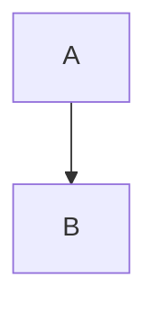

# Chapter 1

类别欧式空间

层次聚类

K-means

BFR方法

分类和聚类

## 语言模型

上下文是否贴切

组合数

N-gram(参数可以用最大似然估计获取）

迷惑度：预测下一条语言的能力

Backoff

扣掉正常的句子

## 正向匹配分词

双向分配法

词网格,给出了一个字符串全部接分可能性

分词歧义

新词，缩写

## 句法分析

CFG 上下文无关

移进-规约方法

## Max-margin 损失函数

雅科比矩阵

## 计算图与反向传播

##深度学习

图像技术

paradigm

词向量

## cnn参数

## RNN (循环神经网络)

82年Hopfield神经网络，模拟人类记忆模型

RNN构建。对于序列有优势，特点是本身存在自循环

GRU:门限循环单元

## 注意力机制

源于神经科学

匹配

隐藏层。最佳答案检测

用了DDN后提升

## 信息抽取中的主要任务

MUC(1)

概念模型

MET
主要对英语，汉语，阿拉伯语进行分析

### 命名实体识别

给命名里面的东西指定一个实体标记

最大熵模型

CRF

实体链接
* 生物医学领域

关系抽取

eg: 
* 比尔盖茨是微软的CEO
* CEO(比尔盖茨，微软)

## 复习

引言：NPL 发展等，歧义，挑战

文本处理基础
* 正则表达式，语料库
* 隐马尔可夫模型
* 句法分析
    * 上下文无关

One-hot
