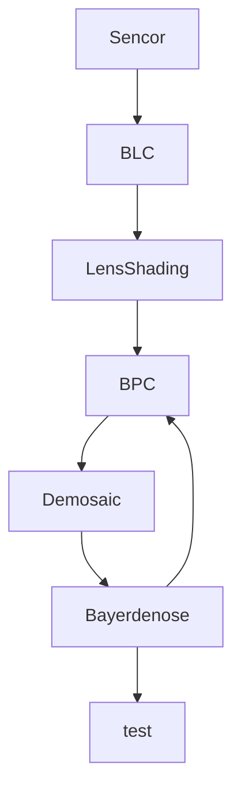

# 梯度下降法

# 可视化
通过计算机将数据转换为图形。渲染

# 光源
和入射光有关

# 近似衡等变化

残差为0

神经元

空域注意力

$$\alpha = softmax(W_{i}a + b_{i})$$

# ISP(Image Singal Processing)

DL for ISP

PyNET

## Deep Learning for Image Restoration

Denosing and super-resolution

多幅输入平均减少噪声干扰

## Semi-coupled Dictionary Learning

加权映射
